# 🍚 yumi-rice

<p>
  
  
  
  
  
  
</p>

**🇬🇧 [English](#en)** · **🇮🇹 [Italiano](#it)** · **🇺🇦 [Українська](#uk)** · **🇷🇺 [Русский](#ru)**

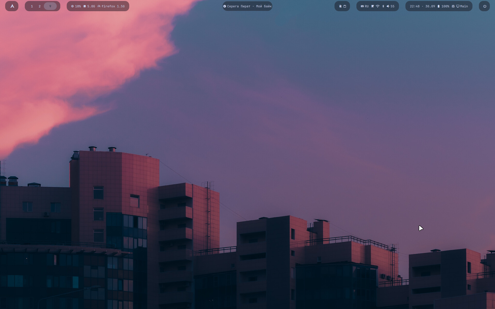

---

<a name="en"></a>

## 🇬🇧 English

My Hyprland desktop on a MacBook Pro M1 running Asahi Linux: Waybar made of "pills", every menu drawn
by one rofi engine, a macOS-like control center on swaync, a lock screen with a music player —
and all of it recolors itself to match the current wallpaper. Plus a sync script that keeps the
repository and the system in step, with a backup of every file it touches.

| | |
|---|---|
| Hardware | MacBook Pro 13" M1 (2020), 8 GB RAM, 2560×1600 display, scale 1.666667 · second monitor MSI G27C3F 1920×1080 @ 180 Hz over USB-C · Logitech PRO keyboard and PRO X 2 mouse |
| OS | Arch Linux ARM ([Asahi](https://asahilinux.org/)), `linux-asahi` kernel, 16K memory pages, btrfs |
| Desktop | [HyDE](https://github.com/HyDE-Project/HyDE) + Hyprland 0.56 with the Lua config, started via uwsm |
| Bar / notifications / menus | Waybar · swaync · rofi |
| Lock / idle / wallpaper | hyprlock · hypridle · awww |
| Terminal / font | kitty · JetBrainsMono Nerd Font |

### Features

- **Waybar of pills:** my own `yumi` layout, every group of modules is a separate rounded pill, only the player
  sits in the center. Left: logo, workspaces, CPU / RAM with the heaviest app. Right: control
  center and clipboard · keyboard layout, VPN, keep-awake, Wi-Fi, Bluetooth, volume · clock, battery, power
  profile, HyDE mode · power button. Custom modules update instantly on their own signal (`pkill -RTMIN+N waybar`).
- **One menu engine, `rofi-panel`:** every menu shares one theme — a rounded translucent window, Nerd Font icons,
  height fitted to the number of rows. Opens under its Waybar icon, in the center, at the cursor or top-right;
  closes when the mouse moves away, when a new window appears, or on a second click.
- **Menus:** power, network (Wi-Fi via `networkmanager_dmenu` + VPN), Bluetooth (devices, pairing), sound and
  microphone (outputs, inputs, volume), power profile, clipboard (cliphist), workspace overview, HyDE modes,
  processes (memory as PSS and CPU per application, close with confirmation, system apps are protected) and a player.
- **Player card:** blurred cover art as the background and control buttons. The cover comes from MPRIS; if there is
  none — a video thumbnail via `yt-dlp`; if that fails too — a piece of the current wallpaper.
- **Control center on swaync:** toggles for Wi-Fi, Bluetooth, VPN, microphone and power saving (double click opens
  the detailed menu), volume and microphone sliders, a full-height notifications view. The header is a strip of
  the wallpaper. System notifications are transient — only messages from people stay. Rendered with cairo:
  0 MB of video memory instead of 38.
- **Everything matches the wallpaper:** change the wallpaper in HyDE and the `hyprlock-bg-watch` service rebuilds
  the blurred lock-screen background, the control-center header, the swaync colors and the rofi theme within a second.
  Generated files are not stored in the repository — only the scripts that make them. Colors come only from the
  wallpaper: wallbash is locked to dark mode, the HyDE themes are switched off and their shortcuts (`SUPER+SHIFT+T/R`)
  unbound.
- **Lock screen:** based on [Hyprlock-Dots #20](https://github.com/mahaveergurjar/Hyprlock-Dots) — login card,
  avatar, date, a mini player with working buttons, clock, uptime and keyboard layout. SDDM autologin → Hyprland →
  hyprlock at once; the desktop is drawn *under* the lock (`session_lock_xray`), so there is no grey frame or lag after unlocking.
- **Hyprland:** the window look (borders, gaps, rounding, blur, opacity) is pinned in `my_look()` and reapplied on
  every reload, so a new wallpaper changes only colors. All my settings live in one `hyprland.lua`; the few HyDE files that
  must be patched are handled by the idempotent `hyde-patches.sh`.
- **Living on 8 GB:** zram the size of RAM + an 8 GB swap file; earlyoom closes browser tabs first and never the
  desktop; Firefox runs in its own cgroup (`firefox.slice`, 4 GB) so an overflow kills one tab, not the session;
  `lim 1G <command>` runs test servers in `dev.slice` with a personal memory cap; Pylance in light mode (~210 MB instead of ~700).
- **System:** silent boot (hidden GRUB menu, `quiet loglevel=3`), btrfs snapshots with snapper (`/` before and after
  every pacman run, `/home` every hour), fast shutdown, faillock, BlueZ Experimental for headphone battery.
- **Two monitors on an M1 MacBook:** the external display runs over USB-C DisplayPort alt mode, made possible by
  [haripako/dp-altmode](https://github.com/haripako/dp-altmode) — thanks to its author. Workspaces 1–5 live on the MacBook, 6–10 on the external monitor, all ten
  stay visible in Waybar. Unplug the monitor and its workspaces move to the laptop; plug it back in and they return, with
  the wallpaper redrawn. The monitor block in `hyprland.lua` is commented out: it is an example for my setup, every
  machine needs its own outputs, modes and positions.
- **Menus sized per monitor:** rofi runs through XWayland and ignores the monitor scale, so a small `rofi` wrapper lowers
  the DPI on the 1080p screen. The monitor is picked by the cursor, because a click on Waybar does not move focus.
- **Logitech without G HUB:** a mouse pill with battery, DPI and polling rate (Solaar) and a menu to change them. The
  keyboard backlight follows the wallpaper through a wallbash template and an OpenRGB server started at login: the color
  changes instantly and no USB rescan gets in Solaar's way (if Solaar is busy anyway, the mouse pill retries and shows
  the last reading). Win and Alt are swapped only on the external keyboard, so Super sits next to the space bar like Cmd
  on the MacBook. Its Fn key never reaches the system, so media keys live on Alt: `ALT+F9–F12` play/pause, stop,
  previous, next; `ALT+Print / Scroll Lock / Pause` mute, volume down, volume up.
- **Every change can be undone:** `./rice push` keeps the previous version of each file in `~/.local/state/rice-bak/`,
  system files are applied one by one after showing the diff, and every add-on has its own full uninstall script.

### Screenshots

| | |
|:---:|:---:|
| 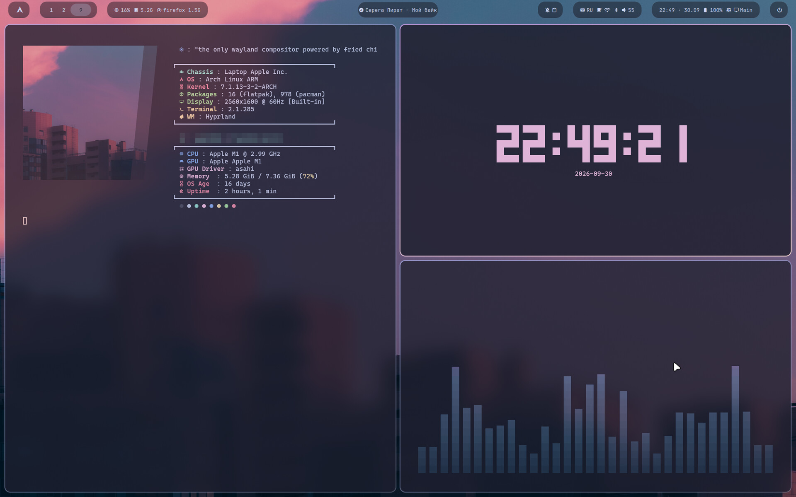 | 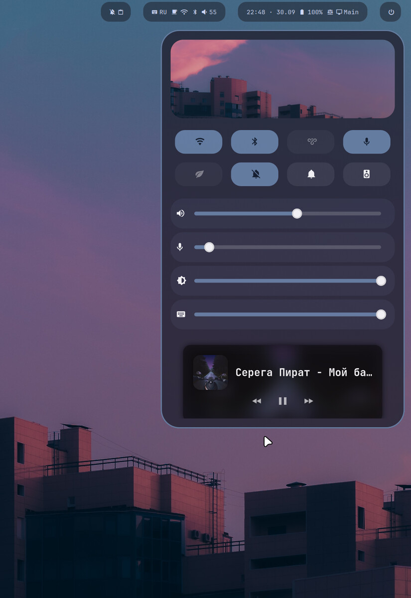 |
| Workspace | Control center |
| 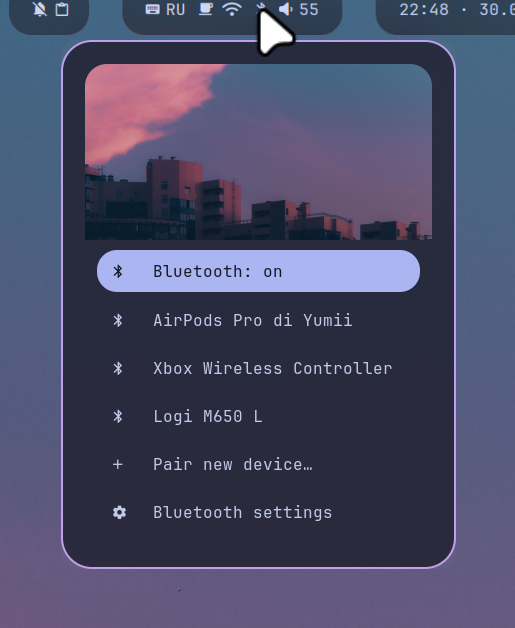 | 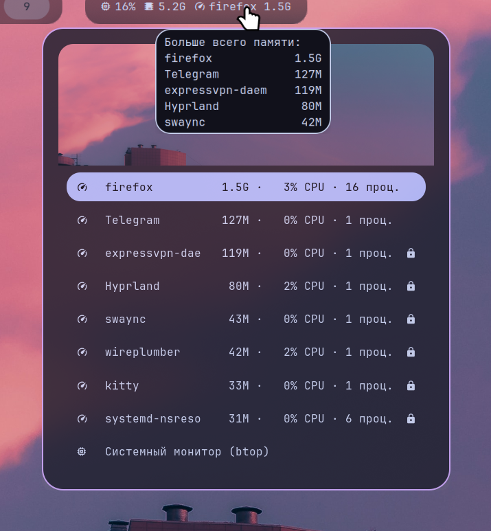 |
| Bluetooth | Heaviest apps |
| 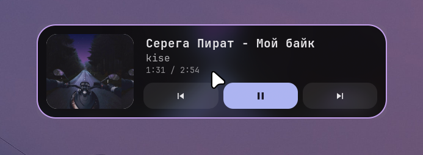 | 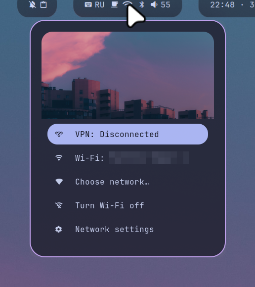 |
| Player card | Network and VPN |
| 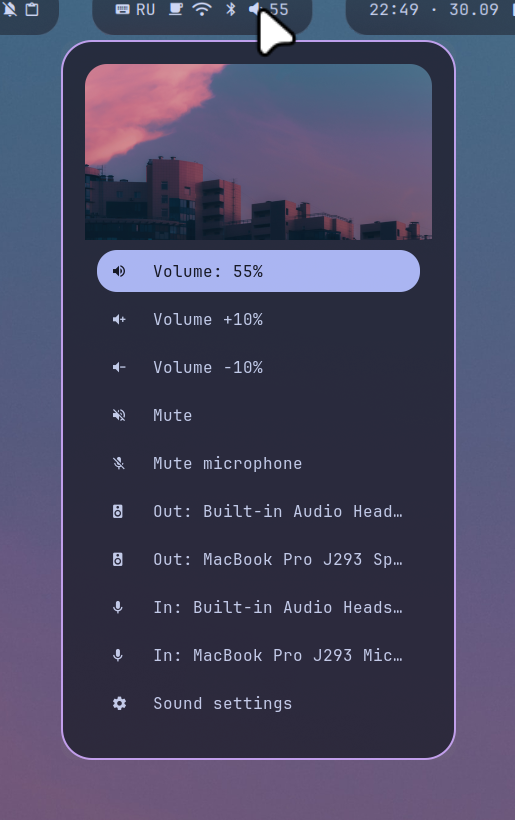 | 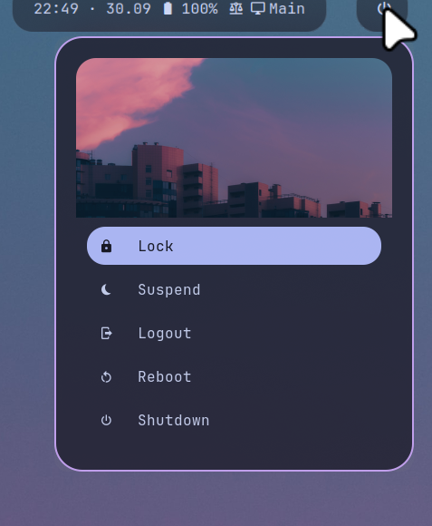 |
| Sound | Power menu |

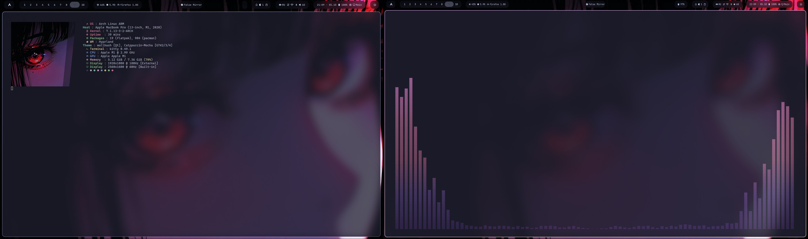
<p align="center">MacBook (2560×1600) and MSI (1920×1080 @ 180 Hz) side by side · cava on the external monitor</p>

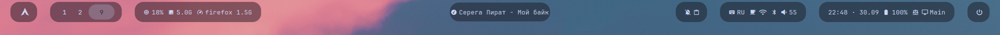

### Keys and gestures

My bindings on top of the standard [HyDE](https://github.com/HyDE-Project/HyDE) ones:

| Keys | Action |
|---|---|
| `SUPER` + `Esc` | Power menu |
| `SUPER` + `N` | Control center |
| `SUPER` + `M` | Player card |
| `SUPER` + `V` | Clipboard |
| `SUPER` + `` ` `` | Workspace overview |
| `SUPER` + `/`, `SUPER` + `SHIFT` + `W` | HyDE modes |
| `SUPER` + `ALT` + `↑` / `↓` | Next / previous HyDE mode |
| Keyboard backlight keys | Backlight brightness (works on the lock screen too) |
| 3 fingers ← / → | Switch workspaces |
| 3 fingers ↓ | Workspace overview |

### Quick start

> [!WARNING]
> These are the configs of **one specific machine**: MacBook M1, Asahi, HyDE, a 2560×1600 display.
> On other hardware use them as a base and borrow parts. Apply the system files (`system/`) only on purpose.

You need [HyDE](https://github.com/HyDE-Project/HyDE) with Hyprland ≥ 0.56 (Lua config) and:

```bash
sudo pacman -S --needed waybar swaync rofi jq cliphist wl-clipboard playerctl imagemagick \
    inotify-tools networkmanager-dmenu bluez-utils power-profiles-daemon libnotify \
    brightnessctl btop kitty ttf-jetbrains-mono-nerd yt-dlp earlyoom zram-generator \
    solaar openrgb
```

```bash
git clone https://github.com/sonoyumi/yumi-rice.git ~/Projects/yumi-rice
cd ~/Projects/yumi-rice
./rice diff            # see what will change
./rice push            # copy the files into ~ (old versions go to ~/.local/state/rice-bak/)
systemctl --user enable --now hyprlock-bg.service
./rice reload
./rice push-system     # optional: /etc, one file at a time with confirmation
```

The repository stores `@HOME@` instead of the home path and `@USER@` in the autologin file — `./rice push`
fills in yours. Put your own avatar into `~/.config/hypr/hyprlock/avatar.jpg`.

- **VPN pill** expects ExpressVPN (`expressvpnctl`); without it the pill stays hidden.

### The `rice` script

The repository is the source of truth; `rice` syncs it with the system.

| Command | What it does |
|---|---|
| `./rice pull` | System → repository |
| `./rice diff [path]` | What differs between the system and the repository |
| `./rice push` | Repository → `~` (backs up the previous versions) |
| `./rice push-system` | Repository → `/etc` (diff and confirmation for every file) |
| `./rice reload` | Reload Hyprland, Waybar, swaync, systemd --user |
| `./rice add <path>` | Start tracking a file |
| `./rice hyde-patches` | Reapply the patches to HyDE files after a HyDE update |
| `./rice doctor` | Quick check: config errors, processes, memory, drift |

Personal tweaks live outside the repository in `~/.config/rice-local/` (same layout as `home/`, plus its own
`manifest.txt`): `./rice` installs them instead of the public files, so private changes never reach GitHub.
`RICE_LOCAL=off ./rice push` installs the clean public version.

Workflow: edit in `home/…` → `./rice push` → `./rice reload` → check → `git commit`.
Didn't like it — `git checkout -- <file>` and `./rice push` again.

### Project structure

```
yumi-rice/
├── home/
│   ├── .config/hypr/       # hyprland.lua, hyprlock, hypridle
│   ├── .config/waybar/     # yumi.jsonc layout and styles
│   ├── .config/swaync/     # control center layouts and style
│   ├── .config/systemd/    # wallpaper sync service, firefox.slice, dev.slice
│   └── .local/bin/         # menus, Waybar modules, control center, tools
├── system/etc/             # GRUB, SDDM, zram, sysctl, earlyoom, BlueZ, faillock
├── assets/screenshots/
├── manifest.txt            # tracked files from ~
├── system-manifest.txt     # tracked files from /etc
├── rice                    # sync script
└── hyde-patches.sh         # patches to HyDE files
```

### Gotchas: Hyprland 0.56 Lua and Asahi

- Options use dots: `hyprctl getoption decoration.rounding`. Dispatchers are Lua:
  `hyprctl dispatch 'hl.dsp.focus({ workspace = 3 })'`. `hyprctl keyword` doesn't work — use `hyprctl eval 'hl.config({...})'`.
- The scale must divide the resolution: `1.666667`, not `1.67`.
- Waybar's built-in `hyprland/language` doesn't work with Lua Hyprland — a custom module is needed.
- rofi runs through XWayland: window offsets are in **physical** pixels, Hyprland opacity rules don't apply (only alpha in rasi).
- swaync runs commands without `XDG_RUNTIME_DIR` — `wpctl` returns 0; sliders need explicit `min_limit/max_limit`.
- hyprlock: `$BACKGROUND_PATH` is unreliable (use an absolute path), `onclick` only works with `hide_cursor = false`,
  `fadeOut, 0` removes the grey frame after boot.
- HyDE's `hypridle.conf` sources **every** file in `hypridle/` — any backup next to your config overrides it.
- HyDE puts an empty `[Autologin]` into `/etc/sddm.conf.d/` — name yours so it sorts last (`zz-…`).
- GRUB can't write `grubenv` on btrfs — no `GRUB_SAVEDEFAULT`. Parameter order matters: `quiet loglevel=3`.
- Asahi has no MGLRU; power-profiles-daemon offers only `balanced` and `power-saver`.
- 16K pages: images with jemalloc built for 4K crash — `muvm` helps.
- `MemoryHigh` without free swap freezes a process instead of killing it — use `MemoryMax`.
- AirPods with macOS dual boot: `br-connection-key-missing` → remove and pair again.
- rofi under XWayland with `force_zero_scaling` draws in physical pixels on every monitor: pass `-dpi` per monitor.
- Solaar reapplies its saved LED zones on start and can switch the keyboard backlight off: mark `led_control` and
  `led_zone_*` as `ignore` in its config.
- OpenRGB `Direct` mode on the PRO keyboard drops keys and its LED order does not match the layout: `Static` is reliable.
- Plain `openrgb` rescans every USB device for a few seconds on each call, and Solaar fails to read the mouse
  meanwhile: start `openrgb --server` once at login and send colors with `--client`.
- A monitor connected after login gets a black background: redraw the wallpaper on `monitor.added`.
- dp-altmode: after unplugging the monitor and suspending, the next connect can fail until a reboot (a known open bug).
  Kernel updates need the patch rebuilt.

### Credits

[HyDE](https://github.com/HyDE-Project/HyDE) (themes, wallbash, layouts) ·
[Hyprland](https://hyprland.org/) · [Asahi Linux](https://asahilinux.org/) ·
[Hyprlock-Dots](https://github.com/mahaveergurjar/Hyprlock-Dots) (lock screen layout) ·
[swaync](https://github.com/ErikReider/SwayNotificationCenter) · [Waybar](https://github.com/Alexays/Waybar) ·
[rofi](https://github.com/davatorium/rofi) ·
[dp-altmode](https://github.com/haripako/dp-altmode) by haripako (USB-C DisplayPort on M1) · [Solaar](https://github.com/pwr-Solaar/Solaar) · [OpenRGB](https://openrgb.org/)

### Author

**Vladyslav Shokun** ([@sonoyumi](https://github.com/sonoyumi)), Python developer: Telegram bots, web scraping, automation.

[](https://t.me/sonoyumiii)
[](mailto:sonoyumiii@gmail.com)
[](https://www.linkedin.com/in/vladyslav-shokun/)

> 💼 Need a Linux desktop set up or a routine automated with scripts? Get in touch.

### License

MIT, see [LICENSE](LICENSE).

---

<a name="it"></a>

## 🇮🇹 Italiano

**[🇬🇧 English](#en)** · **🇮🇹 Italiano** · **[🇺🇦 Українська](#uk)** · **[🇷🇺 Русский](#ru)**

Il mio desktop Hyprland su un MacBook Pro M1 con Asahi Linux: una Waybar fatta di "pillole", tutti i menu
disegnati da un unico motore rofi, un centro di controllo in stile macOS su swaync, una schermata di blocco con
il lettore musicale — e tutto si ricolora in base allo sfondo attuale. In più, uno script che tiene allineati
repository e sistema, con un backup di ogni file che tocca.

| | |
|---|---|
| Hardware | MacBook Pro 13" M1 (2020), 8 GB di RAM, schermo 2560×1600, scala 1.666667 · secondo monitor MSI G27C3F 1920×1080 @ 180 Hz via USB-C · tastiera Logitech PRO e mouse PRO X 2 |
| Sistema | Arch Linux ARM ([Asahi](https://asahilinux.org/)), kernel `linux-asahi`, pagine di memoria da 16K, btrfs |
| Desktop | [HyDE](https://github.com/HyDE-Project/HyDE) + Hyprland 0.56 con configurazione Lua, avviato tramite uwsm |
| Barra / notifiche / menu | Waybar · swaync · rofi |
| Blocco / inattività / sfondo | hyprlock · hypridle · awww |
| Terminale / font | kitty · JetBrainsMono Nerd Font |

### Funzionalità

- **Waybar a pillole:** il mio layout `yumi`, ogni gruppo di moduli è una pillola arrotondata separata, al centro
  solo il lettore. A sinistra: logo, spazi di lavoro, CPU / RAM con l'app più pesante.
  A destra: centro di controllo e appunti · layout della tastiera, VPN, anti-sospensione, Wi-Fi, Bluetooth, volume ·
  orologio, batteria, profilo energetico, modalità HyDE · spegnimento. I moduli personalizzati si aggiornano subito
  con il proprio segnale (`pkill -RTMIN+N waybar`).
- **Un solo motore per i menu, `rofi-panel`:** tutti i menu condividono un tema — finestra arrotondata e traslucida,
  icone Nerd Font, altezza adattata al numero di righe. Si apre sotto l'icona della Waybar, al centro, vicino al cursore
  o in alto a destra; si chiude allontanando il mouse, all'apertura di una nuova finestra o con un secondo clic.
- **Menu:** spegnimento, rete (Wi-Fi tramite `networkmanager_dmenu` + VPN), Bluetooth (dispositivi, abbinamento), audio e
  microfono (uscite, ingressi, volume), profilo energetico, appunti (cliphist), panoramica degli spazi di lavoro, modalità
  HyDE, processi (memoria PSS e CPU per applicazione, chiusura con conferma, app di sistema protette) e lettore.
- **Scheda del lettore:** copertina sfocata come sfondo e pulsanti di controllo. La copertina arriva da MPRIS; se manca —
  la miniatura del video tramite `yt-dlp`; se manca anche quella — un pezzo dello sfondo attuale.
- **Centro di controllo su swaync:** interruttori per Wi-Fi, Bluetooth, VPN, microfono e risparmio energetico (il doppio
  clic apre il menu dettagliato), cursori per volume e microfono, vista delle notifiche a tutta altezza. L'intestazione è una
  striscia dello sfondo. Le notifiche di sistema sono temporanee — restano solo i messaggi delle persone. Disegnato con
  cairo: 0 MB di memoria video invece di 38.
- **Tutto in tinta con lo sfondo:** cambi lo sfondo in HyDE e il servizio `hyprlock-bg-watch` ricrea in un secondo lo sfondo
  sfocato della schermata di blocco, l'intestazione del centro di controllo, i colori di swaync e il tema di rofi.
  I file generati non sono nel repository — solo gli script che li creano. I colori vengono solo dallo sfondo: wallbash
  è bloccato in modalità scura, i temi HyDE sono disattivati e le loro scorciatoie (`SUPER+SHIFT+T/R`) rimosse.
- **Schermata di blocco:** basata su [Hyprlock-Dots n. 20](https://github.com/mahaveergurjar/Hyprlock-Dots) — scheda di
  accesso, avatar, data, mini lettore con pulsanti funzionanti, orologio, uptime e layout della tastiera. Accesso automatico
  SDDM → Hyprland → subito hyprlock; il desktop viene disegnato *sotto* il blocco (`session_lock_xray`), quindi niente
  fotogramma grigio né ritardi dopo lo sblocco.
- **Hyprland:** l'aspetto delle finestre (bordi, spazi, arrotondamento, sfocatura, trasparenza) è fissato in `my_look()` e
  riapplicato a ogni ricaricamento, così un nuovo sfondo cambia solo i colori. Tutte le mie impostazioni stanno in un solo
  `hyprland.lua`; i pochi file di HyDE da modificare passano per lo script idempotente `hyde-patches.sh`.
- **Vivere con 8 GB:** zram grande quanto la RAM + file di swap da 8 GB; earlyoom chiude prima le schede del browser e mai il
  desktop; Firefox gira nel proprio cgroup (`firefox.slice`, 4 GB), quindi un eccesso chiude una scheda, non la sessione;
  `lim 1G <comando>` avvia i server di prova in `dev.slice` con un limite di memoria dedicato; Pylance in modalità leggera
  (~210 MB invece di ~700).
- **Sistema:** avvio silenzioso (menu GRUB nascosto, `quiet loglevel=3`), snapshot btrfs con snapper (`/` prima e dopo
  ogni pacman, `/home` ogni ora), spegnimento rapido, faillock, BlueZ Experimental per la batteria delle cuffie.
- **Due monitor su un MacBook M1:** lo schermo esterno funziona tramite DisplayPort alt mode su USB-C, grazie a
  [haripako/dp-altmode](https://github.com/haripako/dp-altmode) — un ringraziamento al suo autore. Le scrivanie 1–5 stanno sul MacBook, 6–10 sul monitor esterno,
  tutte e dieci restano visibili in Waybar. Scolleghi il monitor e le sue scrivanie passano al portatile; lo ricolleghi e
  tornano, con lo sfondo ridisegnato. Il blocco dei monitor in `hyprland.lua` è commentato: è un esempio della mia
  configurazione, ogni macchina ha le sue uscite, modalità e posizioni.
- **Menu in scala per monitor:** rofi gira tramite XWayland e ignora la scala del monitor, quindi un piccolo wrapper `rofi`
  abbassa i DPI sullo schermo 1080p. Il monitor si sceglie dal cursore, perché un clic su Waybar non sposta il focus.
- **Logitech senza G HUB:** una pillola del mouse con batteria, DPI e frequenza di polling (Solaar) e un menu per
  cambiarli. La retroilluminazione della tastiera segue lo sfondo tramite un template wallbash e un server OpenRGB avviato
  all'accesso: il colore cambia subito e nessuna nuova scansione USB disturba Solaar (se Solaar è comunque occupato, la
  pillola del mouse riprova e mostra l'ultima lettura). Win e Alt sono scambiati solo sulla tastiera esterna, così Super
  sta accanto alla barra spaziatrice come Cmd sul MacBook. Il suo tasto Fn non arriva al sistema, quindi i tasti multimediali
  sono su Alt: `ALT+F9–F12` play/pausa, stop, precedente, successivo; `ALT+Print / Scroll Lock / Pause` muto, volume giù, volume su.
- **Ogni modifica si può annullare:** `./rice push` conserva la versione precedente di ogni file in `~/.local/state/rice-bak/`,
  i file di sistema si applicano uno alla volta dopo aver mostrato il diff, e ogni aggiunta ha il proprio script di rimozione completa.

### Screenshot

Vedi la [galleria nella sezione inglese](#screenshots).

### Tasti e gesti

Le mie scorciatoie in aggiunta a quelle standard di [HyDE](https://github.com/HyDE-Project/HyDE):

| Tasti | Azione |
|---|---|
| `SUPER` + `Esc` | Menu di spegnimento |
| `SUPER` + `N` | Centro di controllo |
| `SUPER` + `M` | Scheda del lettore |
| `SUPER` + `V` | Appunti |
| `SUPER` + `` ` `` | Panoramica degli spazi di lavoro |
| `SUPER` + `/`, `SUPER` + `SHIFT` + `W` | Modalità HyDE |
| `SUPER` + `ALT` + `↑` / `↓` | Modalità HyDE successiva / precedente |
| Tasti retroilluminazione tastiera | Luminosità (funziona anche sulla schermata di blocco) |
| 3 dita ← / → | Cambia spazio di lavoro |
| 3 dita ↓ | Panoramica degli spazi di lavoro |

### Avvio rapido

> [!WARNING]
> Sono le configurazioni di **una macchina precisa**: MacBook M1, Asahi, HyDE, schermo 2560×1600.
> Su altro hardware usale come base e prendi le parti che servono. Applica i file di sistema (`system/`) solo consapevolmente.

Servono [HyDE](https://github.com/HyDE-Project/HyDE) con Hyprland ≥ 0.56 (configurazione Lua) e i pacchetti:

```bash
sudo pacman -S --needed waybar swaync rofi jq cliphist wl-clipboard playerctl imagemagick \
    inotify-tools networkmanager-dmenu bluez-utils power-profiles-daemon libnotify \
    brightnessctl btop kitty ttf-jetbrains-mono-nerd yt-dlp earlyoom zram-generator \
    solaar openrgb
```

```bash
git clone https://github.com/sonoyumi/yumi-rice.git ~/Projects/yumi-rice
cd ~/Projects/yumi-rice
./rice diff            # cosa cambierà
./rice push            # copia i file in ~ (le vecchie versioni vanno in ~/.local/state/rice-bak/)
systemctl --user enable --now hyprlock-bg.service
./rice reload
./rice push-system     # facoltativo: /etc, un file alla volta con conferma
```

Nel repository c'è `@HOME@` al posto del percorso home e `@USER@` nel file di accesso automatico — `./rice push`
inserisce i tuoi valori. Metti il tuo avatar in `~/.config/hypr/hyprlock/avatar.jpg`.

- **Pillola VPN:** pensata per ExpressVPN (`expressvpnctl`); senza di esso resta nascosta.

### Lo script `rice`

Il repository è la fonte di verità; `rice` lo sincronizza con il sistema.

| Comando | Cosa fa |
|---|---|
| `./rice pull` | Sistema → repository |
| `./rice diff [percorso]` | Differenze tra sistema e repository |
| `./rice push` | Repository → `~` (con backup delle versioni precedenti) |
| `./rice push-system` | Repository → `/etc` (diff e conferma per ogni file) |
| `./rice reload` | Ricarica Hyprland, Waybar, swaync, systemd --user |
| `./rice add <percorso>` | Inizia a tracciare un file |
| `./rice hyde-patches` | Riapplica le modifiche ai file di HyDE dopo un aggiornamento |
| `./rice doctor` | Controllo rapido: errori di configurazione, processi, memoria, differenze |

Le modifiche personali stanno fuori dal repository, in `~/.config/rice-local/` (stessa struttura di `home/`, più un proprio
`manifest.txt`): `./rice` le installa al posto dei file pubblici, così le modifiche private non finiscono su GitHub.
`RICE_LOCAL=off ./rice push` installa la versione pubblica pulita.

Flusso di lavoro: modifica in `home/…` → `./rice push` → `./rice reload` → verifica → `git commit`.
Non ti piace — `git checkout -- <file>` e di nuovo `./rice push`.

### Struttura del progetto

```
yumi-rice/
├── home/
│   ├── .config/hypr/       # hyprland.lua, hyprlock, hypridle
│   ├── .config/waybar/     # layout yumi.jsonc e stili
│   ├── .config/swaync/     # layout e stile del centro di controllo
│   ├── .config/systemd/    # servizio di sincronizzazione sfondo, firefox.slice, dev.slice
│   └── .local/bin/         # menu, moduli Waybar, centro di controllo, strumenti
├── system/etc/             # GRUB, SDDM, zram, sysctl, earlyoom, BlueZ, faillock
├── assets/screenshots/
├── manifest.txt            # file tracciati da ~
├── system-manifest.txt     # file tracciati da /etc
├── rice                    # script di sincronizzazione
└── hyde-patches.sh         # modifiche ai file di HyDE
```

### Insidie: Hyprland 0.56 Lua e Asahi

- Le opzioni usano il punto: `hyprctl getoption decoration.rounding`. I dispatcher sono Lua:
  `hyprctl dispatch 'hl.dsp.focus({ workspace = 3 })'`. `hyprctl keyword` non funziona — usa `hyprctl eval 'hl.config({...})'`.
- La scala deve dividere la risoluzione: `1.666667`, non `1.67`.
- Il modulo integrato `hyprland/language` di Waybar non funziona con Hyprland Lua — serve un modulo proprio.
- rofi gira tramite XWayland: gli spostamenti della finestra sono in pixel **fisici**, le regole di trasparenza di Hyprland non valgono (solo l'alfa in rasi).
- swaync esegue i comandi senza `XDG_RUNTIME_DIR` — `wpctl` restituisce 0; i cursori vogliono `min_limit/max_limit` espliciti.
- hyprlock: `$BACKGROUND_PATH` è inaffidabile (meglio un percorso assoluto), `onclick` funziona solo con `hide_cursor = false`,
  `fadeOut, 0` elimina il fotogramma grigio dopo l'avvio.
- Il `hypridle.conf` di HyDE include **ogni** file in `hypridle/` — un backup accanto alla tua configurazione la sovrascrive.
- HyDE mette un `[Autologin]` vuoto in `/etc/sddm.conf.d/` — dai al tuo file un nome che venga per ultimo (`zz-…`).
- GRUB non scrive `grubenv` su btrfs — niente `GRUB_SAVEDEFAULT`. L'ordine dei parametri conta: `quiet loglevel=3`.
- Asahi non ha MGLRU; power-profiles-daemon offre solo `balanced` e `power-saver`.
- Pagine da 16K: le immagini con jemalloc compilato per 4K si bloccano — aiuta `muvm`.
- `MemoryHigh` senza swap libero congela il processo invece di chiuderlo — usa `MemoryMax`.
- AirPods con dual boot macOS: `br-connection-key-missing` → rimuovi e abbina di nuovo.
- rofi sotto XWayland con `force_zero_scaling` disegna in pixel fisici su ogni monitor: serve `-dpi` per monitor.
- Solaar all'avvio riapplica le zone LED salvate e può spegnere la retroilluminazione della tastiera: segna `led_control`
  e `led_zone_*` come `ignore` nella sua configurazione.
- La modalità `Direct` di OpenRGB sulla tastiera PRO salta dei tasti e l'ordine dei LED non corrisponde al layout:
  `Static` è affidabile.
- Ogni chiamata a `openrgb` riscansiona tutti i dispositivi USB per qualche secondo e intanto Solaar non riesce a
  leggere il mouse: avviare `openrgb --server` una volta all'accesso e inviare i colori con `--client`.
- Un monitor collegato dopo il login ha lo sfondo nero: ridisegna lo sfondo su `monitor.added`.
- dp-altmode: dopo aver scollegato il monitor e sospeso il portatile, il collegamento successivo può fallire fino al
  riavvio (bug noto e aperto). Dopo un aggiornamento del kernel la patch va ricompilata.

### Ringraziamenti

[HyDE](https://github.com/HyDE-Project/HyDE) (temi, wallbash, layout) ·
[Hyprland](https://hyprland.org/) · [Asahi Linux](https://asahilinux.org/) ·
[Hyprlock-Dots](https://github.com/mahaveergurjar/Hyprlock-Dots) (layout della schermata di blocco) ·
[swaync](https://github.com/ErikReider/SwayNotificationCenter) · [Waybar](https://github.com/Alexays/Waybar) ·
[rofi](https://github.com/davatorium/rofi) ·
[dp-altmode](https://github.com/haripako/dp-altmode) di haripako (DisplayPort via USB-C su M1) · [Solaar](https://github.com/pwr-Solaar/Solaar) · [OpenRGB](https://openrgb.org/)

### Autore

**Vladyslav Shokun** ([@sonoyumi](https://github.com/sonoyumi)), sviluppatore Python: bot Telegram, web scraping, automazione.

[](https://t.me/sonoyumiii)
[](mailto:sonoyumiii@gmail.com)
[](https://www.linkedin.com/in/vladyslav-shokun/)

> 💼 Vuoi configurare un desktop Linux o automatizzare un lavoro ripetitivo con degli script? Scrivimi.

### Licenza

MIT, vedi [LICENSE](LICENSE).

---

<a name="uk"></a>

## 🇺🇦 Українська

**[🇬🇧 English](#en)** · **[🇮🇹 Italiano](#it)** · **🇺🇦 Українська** · **[🇷🇺 Русский](#ru)**

Мій робочий стіл Hyprland на MacBook Pro M1 з Asahi Linux: Waybar із «пігулок», усі меню малює один рушій
на rofi, центр керування в стилі macOS на swaync, екран блокування з плеєром — і все це перефарбовується
під поточні шпалери. А ще скрипт, який тримає репозиторій і систему синхронними та зберігає резервну копію
кожного файлу, який змінює.

| | |
|---|---|
| Залізо | MacBook Pro 13" M1 (2020), 8 ГБ RAM, екран 2560×1600, масштаб 1.666667 · другий монітор MSI G27C3F 1920×1080 @ 180 Гц через USB-C · клавіатура Logitech PRO і миша PRO X 2 |
| ОС | Arch Linux ARM ([Asahi](https://asahilinux.org/)), ядро `linux-asahi`, сторінки пам'яті 16K, btrfs |
| Робочий стіл | [HyDE](https://github.com/HyDE-Project/HyDE) + Hyprland 0.56 з Lua-конфігом, запуск через uwsm |
| Панель / сповіщення / меню | Waybar · swaync · rofi |
| Блокування / простій / шпалери | hyprlock · hypridle · awww |
| Термінал / шрифт | kitty · JetBrainsMono Nerd Font |

### Можливості

- **Waybar із пігулок:** власний лейаут `yumi`, кожна група модулів — окрема заокруглена пігулка, у центрі лише плеєр.
  Ліворуч: логотип, робочі столи, CPU / RAM і найважча програма. Праворуч: центр керування й буфер
  обміну · розкладка, VPN, «не засинати», Wi-Fi, Bluetooth, гучність · годинник, батарея, профіль живлення, режим HyDE ·
  вимкнення. Власні модулі оновлюються миттєво за своїм сигналом (`pkill -RTMIN+N waybar`).
- **Один рушій меню — `rofi-panel`:** усі меню мають спільну тему — заокруглене напівпрозоре вікно, значки Nerd Font,
  висота за кількістю рядків. Відкривається під значком Waybar, по центру, біля курсора або праворуч угорі; закривається,
  якщо відвести мишу, якщо з'явилося нове вікно, або повторним кліком.
- **Меню:** вимкнення, мережа (Wi-Fi через `networkmanager_dmenu` + VPN), Bluetooth (пристрої, спарювання), звук і
  мікрофон (виходи, входи, гучність), профіль живлення, буфер обміну (cliphist), огляд робочих столів, режими HyDE,
  процеси (пам'ять PSS і CPU за програмами, закрити з підтвердженням, системні захищені) і плеєр.
- **Картка плеєра:** розмита обкладинка тлом і кнопки керування. Обкладинка — з MPRIS; якщо її немає — мініатюра відео
  через `yt-dlp`; якщо й її немає — шматок поточних шпалер.
- **Центр керування на swaync:** перемикачі Wi-Fi, Bluetooth, VPN, мікрофона й енергозбереження (подвійний клік відкриває
  детальне меню), повзунки гучності й мікрофона, окремий вигляд сповіщень на всю висоту. Шапка — смуга зі шпалер.
  Системні сповіщення тимчасові — залишаються лише повідомлення від людей. Малюється через cairo: 0 МБ відеопам'яті замість 38.
- **Усе в колір шпалер:** змінили шпалери в HyDE — служба `hyprlock-bg-watch` за секунду перезбирає розмите тло екрана
  блокування, шапку центру керування, кольори swaync і тему rofi. Згенеровані файли в репозиторії не зберігаються — лише
  скрипти, які їх створюють. Кольори беруться лише зі шпалер: wallbash закріплено в темному режимі, теми HyDE вимкнено,
  а їхні скорочення (`SUPER+SHIFT+T/R`) прибрано.
- **Екран блокування:** на основі [Hyprlock-Dots №20](https://github.com/mahaveergurjar/Hyprlock-Dots) — картка входу,
  аватар, дата, міні-плеєр із робочими кнопками, годинник, uptime і розкладка. Автовхід SDDM → Hyprland → одразу hyprlock;
  робочий стіл малюється *під* блокуванням (`session_lock_xray`), тож після розблокування немає сірого кадру й затримок.
- **Hyprland:** вигляд вікон (рамки, відступи, заокруглення, розмиття, прозорість) закріплено в `my_look()` і
  застосовується після кожного перезавантаження, тож нові шпалери змінюють лише кольори. Усі мої налаштування — в одному
  `hyprland.lua`; ті кілька файлів HyDE, які доводиться правити, обробляє ідемпотентний `hyde-patches.sh`.
- **Життя на 8 ГБ:** zram розміром з RAM + swap-файл 8 ГБ; earlyoom першими закриває вкладки браузера й ніколи — робочий
  стіл; Firefox працює у власній cgroup (`firefox.slice`, 4 ГБ), тож переповнення закриває одну вкладку, а не сесію;
  `lim 1G <команда>` запускає тестові сервери в `dev.slice` з особистим лімітом пам'яті; Pylance у легкому режимі
  (~210 МБ замість ~700).
- **Система:** тихе завантаження (приховане меню GRUB, `quiet loglevel=3`), знімки btrfs через snapper (`/` до й після
  кожного pacman, `/home` щогодини), швидке вимкнення, faillock, BlueZ Experimental для заряду навушників.
- **Два монітори на MacBook M1:** зовнішній екран працює через DisplayPort по USB-C завдяки
  [haripako/dp-altmode](https://github.com/haripako/dp-altmode) — дякую автору. Робочі столи 1–5 на MacBook, 6–10 на зовнішньому моніторі, усі десять видно у
  Waybar. Від'єднали монітор — його столи переїжджають на ноутбук; під'єднали — повертаються, шпалери перемальовуються.
  Блок моніторів у `hyprland.lua` закоментований: це приклад моєї конфігурації, для кожної машини свої виходи, режими й
  позиції.
- **Меню за розміром монітора:** rofi працює через XWayland і не враховує масштаб монітора, тому невелика обгортка `rofi`
  знижує DPI на екрані 1080p. Монітор визначається за курсором, бо клік у Waybar не переносить фокус.
- **Logitech без G HUB:** пігулка миші із зарядом, DPI і частотою опитування (Solaar) та меню, щоб їх змінювати.
  Підсвітка клавіатури змінюється разом зі шпалерами через шаблон wallbash і сервер OpenRGB, що стартує під час входу:
  колір змінюється миттєво, і повторне сканування USB не заважає Solaar (а якщо Solaar усе ж зайнятий, пігулка миші
  повторює запит і показує останні дані). Win і Alt поміняні місцями лише на зовнішній клавіатурі: Super біля пробілу,
  як Cmd на MacBook. Її Fn не доходить до системи, тому медіаклавіші на Alt: `ALT+F9–F12` — пуск/пауза, стоп, попередній,
  наступний трек; `ALT+Print / Scroll Lock / Pause` — вимкнути звук, тихіше, гучніше.
- **Будь-яку зміну можна відкотити:** `./rice push` зберігає попередню версію кожного файлу в `~/.local/state/rice-bak/`,
  системні файли застосовуються по одному з показом diff, а кожне доповнення має власний скрипт повного видалення.

### Скриншоти

Див. [галерею в англійському розділі](#screenshots).

### Клавіші й жести

Мої бінди на додачу до стандартних [HyDE](https://github.com/HyDE-Project/HyDE):

| Клавіші | Дія |
|---|---|
| `SUPER` + `Esc` | Меню вимкнення |
| `SUPER` + `N` | Центр керування |
| `SUPER` + `M` | Картка плеєра |
| `SUPER` + `V` | Буфер обміну |
| `SUPER` + `` ` `` | Огляд робочих столів |
| `SUPER` + `/`, `SUPER` + `SHIFT` + `W` | Режими HyDE |
| `SUPER` + `ALT` + `↑` / `↓` | Наступний / попередній режим HyDE |
| Клавіші підсвітки клавіатури | Яскравість підсвітки (працює й на екрані блокування) |
| 3 пальці ← / → | Перемикання робочих столів |
| 3 пальці ↓ | Огляд робочих столів |

### Швидкий старт

> [!WARNING]
> Це конфіги **конкретної машини**: MacBook M1, Asahi, HyDE, екран 2560×1600.
> На іншому залізі беріть їх за основу й запозичуйте окремі частини. Системні файли (`system/`) застосовуйте лише свідомо.

Потрібен [HyDE](https://github.com/HyDE-Project/HyDE) з Hyprland ≥ 0.56 (Lua-конфіг) і пакети:

```bash
sudo pacman -S --needed waybar swaync rofi jq cliphist wl-clipboard playerctl imagemagick \
    inotify-tools networkmanager-dmenu bluez-utils power-profiles-daemon libnotify \
    brightnessctl btop kitty ttf-jetbrains-mono-nerd yt-dlp earlyoom zram-generator \
    solaar openrgb
```

```bash
git clone https://github.com/sonoyumi/yumi-rice.git ~/Projects/yumi-rice
cd ~/Projects/yumi-rice
./rice diff            # що зміниться
./rice push            # розкласти файли в ~ (старі версії — в ~/.local/state/rice-bak/)
systemctl --user enable --now hyprlock-bg.service
./rice reload
./rice push-system     # за бажанням: /etc, по одному файлу з підтвердженням
```

У репозиторії замість домашнього шляху стоїть мітка `@HOME@`, а в автовході — `@USER@`: `./rice push` підставить
ваші значення. Свій аватар покладіть у `~/.config/hypr/hyprlock/avatar.jpg`.

- **Пігулка VPN** розрахована на ExpressVPN (`expressvpnctl`); без нього вона просто прихована.

### Скрипт `rice`

Репозиторій — джерело істини, `rice` синхронізує його із системою.

| Команда | Що робить |
|---|---|
| `./rice pull` | Система → репозиторій |
| `./rice diff [шлях]` | Чим система відрізняється від репозиторію |
| `./rice push` | Репозиторій → `~` (з резервною копією попередніх версій) |
| `./rice push-system` | Репозиторій → `/etc` (diff і підтвердження для кожного файлу) |
| `./rice reload` | Перечитати Hyprland, Waybar, swaync, systemd --user |
| `./rice add <шлях>` | Почати відстежувати файл |
| `./rice hyde-patches` | Знову застосувати правки до файлів HyDE після його оновлення |
| `./rice doctor` | Швидка перевірка: помилки конфігу, процеси, пам'ять, розбіжності |

Особисті правки лежать поза репозиторієм, у `~/.config/rice-local/` (та сама структура, що й `home/`, плюс власний
`manifest.txt`): `./rice` ставить їх замість публічних файлів, тож приватні зміни не потрапляють на GitHub.
`RICE_LOCAL=off ./rice push` ставить чисту публічну версію.

Робота: правка в `home/…` → `./rice push` → `./rice reload` → перевірити → `git commit`.
Не сподобалося — `git checkout -- <файл>` і знову `./rice push`.

### Структура проєкту

```
yumi-rice/
├── home/
│   ├── .config/hypr/       # hyprland.lua, hyprlock, hypridle
│   ├── .config/waybar/     # лейаут yumi.jsonc і стилі
│   ├── .config/swaync/     # розкладки й стиль центру керування
│   ├── .config/systemd/    # служба синхронізації шпалер, firefox.slice, dev.slice
│   └── .local/bin/         # меню, модулі Waybar, центр керування, утиліти
├── system/etc/             # GRUB, SDDM, zram, sysctl, earlyoom, BlueZ, faillock
├── assets/screenshots/
├── manifest.txt            # які файли з ~ відстежуються
├── system-manifest.txt     # які файли з /etc відстежуються
├── rice                    # скрипт синхронізації
└── hyde-patches.sh         # правки до файлів HyDE
```

### Підводні камені: Hyprland 0.56 Lua та Asahi

- Опції через крапку: `hyprctl getoption decoration.rounding`. Диспетчери — Lua:
  `hyprctl dispatch 'hl.dsp.focus({ workspace = 3 })'`. `hyprctl keyword` не працює — `hyprctl eval 'hl.config({...})'`.
- Масштаб має ділити роздільну здатність: `1.666667`, а не `1.67`.
- Вбудований модуль Waybar `hyprland/language` не працює з Lua-Hyprland — потрібен власний.
- rofi працює через XWayland: зсуви вікна — у **фізичних** пікселях, правила прозорості Hyprland на нього не діють (лише альфа в rasi).
- swaync запускає команди без `XDG_RUNTIME_DIR` — `wpctl` повертає 0; повзункам потрібні явні `min_limit/max_limit`.
- hyprlock: `$BACKGROUND_PATH` ненадійний (краще абсолютний шлях), `onclick` працює лише з `hide_cursor = false`,
  `fadeOut, 0` прибирає сірий кадр після завантаження.
- `hypridle.conf` від HyDE підключає **всі** файли з `hypridle/` — будь-яка резервна копія поруч перебиває ваш конфіг.
- HyDE кладе в `/etc/sddm.conf.d/` порожній `[Autologin]` — називайте свій файл так, щоб він був останнім за абеткою (`zz-…`).
- GRUB не пише `grubenv` на btrfs — без `GRUB_SAVEDEFAULT`. Порядок параметрів важливий: `quiet loglevel=3`.
- На Asahi немає MGLRU; power-profiles-daemon має лише `balanced` і `power-saver`.
- Сторінки 16K: образи з jemalloc, зібраним під 4K, падають — рятує `muvm`.
- `MemoryHigh` без вільного свопу заморожує процес замість того, щоб закрити його, — використовуйте `MemoryMax`.
- AirPods при подвійному завантаженні з macOS: `br-connection-key-missing` → видалити й спарити знову.
- rofi під XWayland з `force_zero_scaling` малює у фізичних пікселях на будь-якому моніторі: потрібен свій `-dpi` для кожного.
- Solaar під час запуску застосовує збережені зони підсвітки і може вимкнути підсвітку клавіатури: позначте `led_control`
  і `led_zone_*` як `ignore` у його конфігурації.
- Режим `Direct` в OpenRGB на клавіатурі PRO пропускає клавіші, а порядок світлодіодів не збігається з розкладкою:
  надійний `Static`.
- Звичайний `openrgb` за кожного виклику кілька секунд заново опитує всі USB-пристрої, і Solaar тим часом не може
  прочитати мишу: запускати `openrgb --server` один раз під час входу, а колір надсилати через `--client`.
- Монітор, під'єднаний після входу, отримує чорне тло: перемальовуйте шпалери за подією `monitor.added`.
- dp-altmode: якщо від'єднати монітор і приспати ноутбук, наступне під'єднання може не спрацювати до перезавантаження
  (відомий відкритий баг). Після оновлення ядра патч треба перезібрати.

### Подяки

[HyDE](https://github.com/HyDE-Project/HyDE) (теми, wallbash, лейаути) ·
[Hyprland](https://hyprland.org/) · [Asahi Linux](https://asahilinux.org/) ·
[Hyprlock-Dots](https://github.com/mahaveergurjar/Hyprlock-Dots) (розкладка екрана блокування) ·
[swaync](https://github.com/ErikReider/SwayNotificationCenter) · [Waybar](https://github.com/Alexays/Waybar) ·
[rofi](https://github.com/davatorium/rofi) ·
[dp-altmode](https://github.com/haripako/dp-altmode) від haripako (DisplayPort по USB-C на M1) · [Solaar](https://github.com/pwr-Solaar/Solaar) · [OpenRGB](https://openrgb.org/)

### Автор

**Vladyslav Shokun** ([@sonoyumi](https://github.com/sonoyumi)) — Python-розробник: Telegram-боти, парсинг, автоматизація.

[](https://t.me/sonoyumiii)
[](mailto:sonoyumiii@gmail.com)
[](https://www.linkedin.com/in/vladyslav-shokun/)

> 💼 Потрібно налаштувати робочий стіл Linux або автоматизувати рутину скриптами? Напишіть мені.

### Ліцензія

MIT — див. [LICENSE](LICENSE).

---

<a name="ru"></a>

## 🇷🇺 Русский

**[🇬🇧 English](#en)** · **[🇮🇹 Italiano](#it)** · **[🇺🇦 Українська](#uk)** · **🇷🇺 Русский**

Мой рабочий стол Hyprland на MacBook Pro M1 с Asahi Linux: Waybar из «пилюль», все меню рисует один движок
на rofi, центр управления в стиле macOS на swaync, экран блокировки с плеером — и всё это перекрашивается
под текущие обои. А ещё скрипт, который держит репозиторий и систему синхронными и сохраняет резервную копию
каждого файла, который меняет.

| | |
|---|---|
| Железо | MacBook Pro 13" M1 (2020), 8 ГБ RAM, экран 2560×1600, масштаб 1.666667 · второй монитор MSI G27C3F 1920×1080 @ 180 Гц через USB-C · клавиатура Logitech PRO и мышь PRO X 2 |
| ОС | Arch Linux ARM ([Asahi](https://asahilinux.org/)), ядро `linux-asahi`, страницы памяти 16K, btrfs |
| Рабочий стол | [HyDE](https://github.com/HyDE-Project/HyDE) + Hyprland 0.56 с Lua-конфигом, запуск через uwsm |
| Бар / уведомления / меню | Waybar · swaync · rofi |
| Блокировка / простой / обои | hyprlock · hypridle · awww |
| Терминал / шрифт | kitty · JetBrainsMono Nerd Font |

### Возможности

- **Waybar из пилюль:** свой лейаут `yumi`, каждая группа модулей — отдельная скруглённая пилюля, в центре только плеер.
  Слева: логотип, рабочие столы, CPU / RAM и самое тяжёлое приложение. Справа: центр управления и
  буфер обмена · раскладка, VPN, «не засыпать», Wi-Fi, Bluetooth, громкость · часы, батарея, профиль питания, режим HyDE ·
  выключение. Свои модули обновляются мгновенно по своему сигналу (`pkill -RTMIN+N waybar`).
- **Один движок меню — `rofi-panel`:** у всех меню общая тема — скруглённое полупрозрачное окно, значки Nerd Font,
  высота по числу строк. Открывается под значком Waybar, по центру, у курсора или справа сверху; закрывается, если увести
  мышь, если появилось новое окно, или повторным кликом.
- **Меню:** выключение, сеть (Wi-Fi через `networkmanager_dmenu` + VPN), Bluetooth (устройства, сопряжение), звук и
  микрофон (выходы, входы, громкость), профиль питания, буфер обмена (cliphist), обзор рабочих столов, режимы HyDE,
  процессы (память PSS и CPU по приложениям, закрыть с подтверждением, системные защищены) и плеер.
- **Карточка плеера:** размытая обложка фоном и кнопки управления. Обложка — из MPRIS; если её нет — миниатюра видео
  через `yt-dlp`; если и её нет — кусок текущих обоев.
- **Центр управления на swaync:** переключатели Wi-Fi, Bluetooth, VPN, микрофона и энергосбережения (двойной клик открывает
  подробное меню), ползунки громкости и микрофона, отдельный вид уведомлений на всю высоту. Шапка — полоса из обоев.
  Системные уведомления временные — остаются только сообщения от людей. Рисуется через cairo: 0 МБ видеопамяти вместо 38.
- **Всё в цвет обоев:** сменили обои в HyDE — служба `hyprlock-bg-watch` за секунду пересобирает размытый фон экрана
  блокировки, шапку центра управления, цвета swaync и тему rofi. Сгенерированные файлы в репозитории не хранятся — только
  скрипты, которые их делают. Цвета берутся только из обоев: wallbash закреплён в тёмном режиме, темы HyDE отключены,
  а их сочетания клавиш (`SUPER+SHIFT+T/R`) убраны.
- **Экран блокировки:** на основе [Hyprlock-Dots №20](https://github.com/mahaveergurjar/Hyprlock-Dots) — карточка входа,
  аватар, дата, мини-плеер с рабочими кнопками, часы, uptime и раскладка. Автовход SDDM → Hyprland → сразу hyprlock;
  рабочий стол рисуется *под* блокировкой (`session_lock_xray`), поэтому после разблокировки нет серого кадра и задержек.
- **Hyprland:** вид окон (рамки, отступы, скругление, размытие, прозрачность) закреплён в `my_look()` и применяется после
  каждой перезагрузки, так что новые обои меняют только цвета. Все мои настройки — в одном `hyprland.lua`; те немногие файлы
  HyDE, которые приходится править, обрабатывает идемпотентный `hyde-patches.sh`.
- **Жизнь на 8 ГБ:** zram размером с RAM + swap-файл 8 ГБ; earlyoom первыми закрывает вкладки браузера и никогда — рабочий
  стол; Firefox работает в своей cgroup (`firefox.slice`, 4 ГБ), поэтому переполнение закрывает одну вкладку, а не сессию;
  `lim 1G <команда>` запускает тестовые серверы в `dev.slice` с личным лимитом памяти; Pylance в лёгком режиме
  (~210 МБ вместо ~700).
- **Система:** тихая загрузка (скрытое меню GRUB, `quiet loglevel=3`), снимки btrfs через snapper (`/` до и после каждого
  pacman, `/home` каждый час), быстрое выключение, faillock, BlueZ Experimental для заряда наушников.
- **Два монитора на MacBook M1:** внешний экран работает через DisplayPort по USB-C благодаря
  [haripako/dp-altmode](https://github.com/haripako/dp-altmode) — спасибо автору. Рабочие столы 1–5 на MacBook, 6–10 на внешнем мониторе, все десять видны в
  Waybar. Отключили монитор — его столы переезжают на ноутбук; подключили — возвращаются, обои перерисовываются.
  Блок мониторов в `hyprland.lua` закомментирован: это пример моей конфигурации, у каждой машины свои выходы, режимы и
  позиции.
- **Меню по размеру монитора:** rofi работает через XWayland и не учитывает масштаб монитора, поэтому небольшая обёртка
  `rofi` снижает DPI на экране 1080p. Монитор определяется по курсору, потому что клик по Waybar не переносит фокус.
- **Logitech без G HUB:** пилюля мыши с зарядом, DPI и частотой опроса (Solaar) и меню, чтобы их менять. Подсветка
  клавиатуры меняется вместе с обоями через шаблон wallbash и сервер OpenRGB, который запускается при входе: цвет
  меняется мгновенно, и повторный опрос USB не мешает Solaar (а если Solaar всё же занят, пилюля мыши повторяет запрос
  и показывает последние данные). Win и Alt поменяны местами только на внешней клавиатуре: Super у пробела, как Cmd на
  MacBook. Её Fn не доходит до системы, поэтому медиаклавиши на Alt: `ALT+F9–F12` — пуск/пауза, стоп, предыдущий,
  следующий трек; `ALT+Print / Scroll Lock / Pause` — выключить звук, тише, громче.
- **Любую правку можно откатить:** `./rice push` сохраняет прежнюю версию каждого файла в `~/.local/state/rice-bak/`,
  системные файлы применяются по одному с показом diff, а у каждой доработки свой скрипт полного удаления.

### Скриншоты

См. [галерею в английском разделе](#screenshots).

### Клавиши и жесты

Мои бинды в дополнение к стандартным [HyDE](https://github.com/HyDE-Project/HyDE):

| Клавиши | Действие |
|---|---|
| `SUPER` + `Esc` | Меню выключения |
| `SUPER` + `N` | Центр управления |
| `SUPER` + `M` | Карточка плеера |
| `SUPER` + `V` | Буфер обмена |
| `SUPER` + `` ` `` | Обзор рабочих столов |
| `SUPER` + `/`, `SUPER` + `SHIFT` + `W` | Режимы HyDE |
| `SUPER` + `ALT` + `↑` / `↓` | Следующий / предыдущий режим HyDE |
| Клавиши подсветки клавиатуры | Яркость подсветки (работает и на экране блокировки) |
| 3 пальца ← / → | Переключение рабочих столов |
| 3 пальца ↓ | Обзор рабочих столов |

### Быстрый старт

> [!WARNING]
> Это конфиги **конкретной машины**: MacBook M1, Asahi, HyDE, экран 2560×1600.
> На другом железе берите их за основу и заимствуйте отдельные части. Системные файлы (`system/`) применяйте только осознанно.

Нужен [HyDE](https://github.com/HyDE-Project/HyDE) с Hyprland ≥ 0.56 (Lua-конфиг) и пакеты:

```bash
sudo pacman -S --needed waybar swaync rofi jq cliphist wl-clipboard playerctl imagemagick \
    inotify-tools networkmanager-dmenu bluez-utils power-profiles-daemon libnotify \
    brightnessctl btop kitty ttf-jetbrains-mono-nerd yt-dlp earlyoom zram-generator \
    solaar openrgb
```

```bash
git clone https://github.com/sonoyumi/yumi-rice.git ~/Projects/yumi-rice
cd ~/Projects/yumi-rice
./rice diff            # что изменится
./rice push            # разложить файлы по ~ (старые версии — в ~/.local/state/rice-bak/)
systemctl --user enable --now hyprlock-bg.service
./rice reload
./rice push-system     # по желанию: /etc, по одному файлу с подтверждением
```

В репозитории вместо домашнего пути стоит метка `@HOME@`, а в автовходе — `@USER@`: `./rice push` подставит
ваши значения. Свой аватар положите в `~/.config/hypr/hyprlock/avatar.jpg`.

- **Пилюля VPN** рассчитана на ExpressVPN (`expressvpnctl`); без него она просто скрыта.

### Скрипт `rice`

Репозиторий — источник истины, `rice` синхронизирует его с системой.

| Команда | Что делает |
|---|---|
| `./rice pull` | Система → репозиторий |
| `./rice diff [путь]` | Чем система отличается от репозитория |
| `./rice push` | Репозиторий → `~` (с резервной копией прежних версий) |
| `./rice push-system` | Репозиторий → `/etc` (diff и подтверждение для каждого файла) |
| `./rice reload` | Перечитать Hyprland, Waybar, swaync, systemd --user |
| `./rice add <путь>` | Начать отслеживать файл |
| `./rice hyde-patches` | Заново применить правки к файлам HyDE после его обновления |
| `./rice doctor` | Быстрая проверка: ошибки конфига, процессы, память, расхождения |

Личные правки лежат вне репозитория, в `~/.config/rice-local/` (та же структура, что у `home/`, плюс свой
`manifest.txt`): `./rice` ставит их вместо публичных файлов, поэтому личные изменения не попадают на GitHub.
`RICE_LOCAL=off ./rice push` ставит чистую публичную версию.

Работа: правка в `home/…` → `./rice push` → `./rice reload` → проверить → `git commit`.
Не понравилось — `git checkout -- <файл>` и снова `./rice push`.

### Структура проекта

```
yumi-rice/
├── home/
│   ├── .config/hypr/       # hyprland.lua, hyprlock, hypridle
│   ├── .config/waybar/     # лейаут yumi.jsonc и стили
│   ├── .config/swaync/     # раскладки и стиль центра управления
│   ├── .config/systemd/    # служба синхронизации обоев, firefox.slice, dev.slice
│   └── .local/bin/         # меню, модули Waybar, центр управления, утилиты
├── system/etc/             # GRUB, SDDM, zram, sysctl, earlyoom, BlueZ, faillock
├── assets/screenshots/
├── manifest.txt            # какие файлы из ~ отслеживаются
├── system-manifest.txt     # какие файлы из /etc отслеживаются
├── rice                    # скрипт синхронизации
└── hyde-patches.sh         # правки к файлам HyDE
```

### Грабли: Hyprland 0.56 Lua и Asahi

- Опции через точку: `hyprctl getoption decoration.rounding`. Диспатчеры — Lua:
  `hyprctl dispatch 'hl.dsp.focus({ workspace = 3 })'`. `hyprctl keyword` не работает — `hyprctl eval 'hl.config({...})'`.
- Масштаб должен делить разрешение: `1.666667`, а не `1.67`.
- Встроенный модуль Waybar `hyprland/language` не работает с Lua-Hyprland — нужен свой.
- rofi работает через XWayland: смещения окна — в **физических** пикселях, правила прозрачности Hyprland на него не действуют (только альфа в rasi).
- swaync запускает команды без `XDG_RUNTIME_DIR` — `wpctl` возвращает 0; ползункам нужны явные `min_limit/max_limit`.
- hyprlock: `$BACKGROUND_PATH` ненадёжен (лучше абсолютный путь), `onclick` работает только с `hide_cursor = false`,
  `fadeOut, 0` убирает серый кадр после загрузки.
- `hypridle.conf` у HyDE подключает **все** файлы из `hypridle/` — любой бэкап рядом перебивает ваш конфиг.
- HyDE кладёт в `/etc/sddm.conf.d/` пустой `[Autologin]` — называйте свой файл так, чтобы он был последним по алфавиту (`zz-…`).
- GRUB не пишет `grubenv` на btrfs — без `GRUB_SAVEDEFAULT`. Порядок параметров важен: `quiet loglevel=3`.
- На Asahi нет MGLRU; у power-profiles-daemon только `balanced` и `power-saver`.
- Страницы 16K: образы с jemalloc, собранным под 4K, падают — выручает `muvm`.
- `MemoryHigh` без свободного свопа замораживает процесс вместо того, чтобы закрыть, — используйте `MemoryMax`.
- AirPods при двойной загрузке с macOS: `br-connection-key-missing` → удалить и сопрячь заново.
- rofi под XWayland с `force_zero_scaling` рисует в физических пикселях на любом мониторе: нужен свой `-dpi` для каждого.
- Solaar при запуске применяет сохранённые зоны подсветки и может погасить клавиатуру: пометьте `led_control` и
  `led_zone_*` как `ignore` в его конфиге.
- Режим `Direct` в OpenRGB на клавиатуре PRO пропускает клавиши, а порядок светодиодов не совпадает с раскладкой:
  надёжен `Static`.
- Обычный `openrgb` при каждом вызове несколько секунд заново опрашивает все USB-устройства, и Solaar в это время не
  может прочитать мышь: запускать `openrgb --server` один раз при входе, а цвет отправлять через `--client`.
- Монитор, подключённый после входа, получает чёрный фон: перерисовывайте обои по событию `monitor.added`.
- dp-altmode: если отключить монитор и усыпить ноутбук, следующее подключение может не сработать до перезагрузки
  (известный открытый баг). После обновления ядра патч нужно пересобрать.

### Благодарности

[HyDE](https://github.com/HyDE-Project/HyDE) (темы, wallbash, лейауты) ·
[Hyprland](https://hyprland.org/) · [Asahi Linux](https://asahilinux.org/) ·
[Hyprlock-Dots](https://github.com/mahaveergurjar/Hyprlock-Dots) (раскладка экрана блокировки) ·
[swaync](https://github.com/ErikReider/SwayNotificationCenter) · [Waybar](https://github.com/Alexays/Waybar) ·
[rofi](https://github.com/davatorium/rofi) ·
[dp-altmode](https://github.com/haripako/dp-altmode) от haripako (DisplayPort по USB-C на M1) · [Solaar](https://github.com/pwr-Solaar/Solaar) · [OpenRGB](https://openrgb.org/)

### Автор

**Vladyslav Shokun** ([@sonoyumi](https://github.com/sonoyumi)) — Python-разработчик: Telegram-боты, парсинг, автоматизация.

[](https://t.me/sonoyumiii)
[](mailto:sonoyumiii@gmail.com)
[](https://www.linkedin.com/in/vladyslav-shokun/)

> 💼 Нужно настроить рабочий стол Linux или автоматизировать рутину скриптами? Напишите мне.

### Лицензия

MIT — см. [LICENSE](LICENSE).
